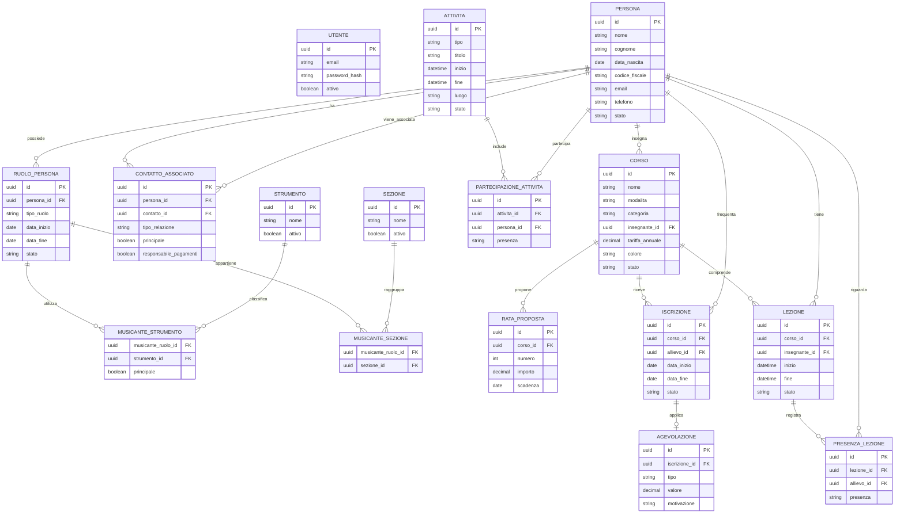

# Arsis — Specifica funzionale della webapp gestionale

**Versione:** 0.2  
**Stato:** bozza consolidata per MVP  
**Data:** 19 agosto 2026  
**Destinatari:** responsabili dell’associazione, progettisti e sviluppatori

---

## 1. Scopo del documento

Questo documento descrive i requisiti funzionali dell’MVP della webapp Arsis per la gestione di una scuola di musica e delle attività della banda.

La specifica raccoglie le decisioni emerse durante l’intervista iniziale e definisce:

- perimetro e obiettivi dell’MVP;
- struttura della navigazione;
- pagine e principali flussi operativi;
- regole di business;
- modello dati concettuale;
- requisiti di sicurezza e usabilità;
- funzionalità escluse o rinviate.

La gestione della **Contabilità** è intenzionalmente lasciata da definire, perché richiede un’analisi dedicata.

### 1.1 Documenti di riferimento

- Logo e favicon ufficiali Arsis forniti con il brief iniziale.
- **Arsis — Design Tokens**, versione 1.1, giugno 2026 (`arsis-design-tokens.md`).

Il documento dei design token è la fonte di riferimento per colori, tipografia, spaziatura, raggi, ombre e transizioni dell’interfaccia. In caso di divergenza, i requisiti funzionali di questa specifica definiscono il comportamento, mentre i design token definiscono la presentazione.

## 2. Obiettivi del prodotto

La webapp deve offrire ai responsabili un unico punto di accesso per:

1. gestire l’anagrafica comune di allievi, insegnanti, musicanti e soci;
2. organizzare prove, concerti ed eventi della banda;
3. configurare corsi, iscrizioni, lezioni e presenze della scuola;
4. accedere rapidamente all’archivio documentale su Google Drive;
5. predisporre un’area futura per la gestione contabile.

## 3. Perimetro dell’MVP

### 3.1 Funzionalità incluse

- Login con email e password.
- Accesso riservato ai responsabili.
- Anagrafica unica delle persone.
- Assegnazione di più ruoli alla stessa persona.
- Gestione dei contatti associati tra persone registrate.
- Gestione di soci, musicanti, strumenti e sezioni.
- Gestione di prove, concerti ed eventi.
- Convocazione predefinita dei musicanti attivi.
- Rilevazione delle presenze alle attività.
- Gestione di corsi individuali e collettivi.
- Gestione delle iscrizioni degli allievi ai corsi.
- Tariffe annuali per corso e agevolazioni individuali.
- Inserimento manuale delle lezioni.
- Registro delle presenze alle lezioni.
- Collegamento a una cartella Google Drive.
- Archiviazione logica dei dati, senza cancellazione definitiva.
- Dashboard Home essenziale.

### 3.2 Funzionalità escluse o rinviate

- Contabilità di rate, pagamenti, compensi e rimborsi: **TBD**.
- Importazione Excel di lezioni e presenze: fuori dall’MVP.
- Collegamento di documenti Drive a persone, corsi o attività.
- Gestione delle spese e dei rimborsi associati alle attività.
- Portale dedicato ad allievi, genitori o insegnanti.
- Ottimizzazione specifica per smartphone e tablet.

## 4. Utenti e autorizzazioni

### 4.1 Profilo utente

Nell’MVP è previsto un solo profilo applicativo:

- **Responsabile:** può consultare, creare e modificare tutti i dati disponibili nell’applicazione.

Non sono previsti accessi per allievi, genitori, insegnanti o musicanti.

### 4.2 Autenticazione

- Accesso tramite email e password.
- Le password non devono essere memorizzate in chiaro.
- L’utente autenticato deve poter effettuare il logout.
- Gli utenti disabilitati non devono poter accedere.

### 4.3 Tracciamento minimo

Per le entità principali è opportuno registrare:

- data e autore della creazione;
- data e autore dell’ultima modifica;
- data e autore dell’archiviazione.

## 5. Architettura della navigazione

L’interfaccia è progettata principalmente per l’uso da PC.

### 5.1 Topbar

La topbar contiene le aree principali:

1. **Home**
2. **Soci**
3. **Attività**
4. **Scuola**
5. **Archivio**
6. **Contabilità**

La selezione di un’area aggiorna il contenuto della sidebar sinistra.

### 5.2 Sidebar per area

| Area | Voci della sidebar |
|---|---|
| Home | Dashboard |
| Soci | Tutte le persone; Soci; Musicanti; Allievi; Insegnanti |
| Attività | Calendario; Tutte le attività; Prove; Concerti; Eventi; Presenze |
| Scuola | Corsi; Iscrizioni; Lezioni; Registro presenze |
| Archivio | Apri Google Drive |
| Contabilità | Pagina informativa “Funzionalità da definire” |

Le liste di Soci, Musicanti, Allievi e Insegnanti sono viste filtrate della stessa anagrafica e non archivi separati.

## 6. Requisiti funzionali trasversali

### RF-TR-01 — Ricerca e filtri

Le liste principali devono consentire almeno:

- ricerca testuale;
- filtro per stato attivo/archiviato;
- filtri specifici dell’area;
- ordinamento delle colonne principali;
- azzeramento dei filtri.

### RF-TR-02 — Stati e archiviazione

- Persone, ruoli, corsi e attività non devono essere eliminati definitivamente dall’interfaccia.
- L’azione di rimozione deve tradursi in archiviazione o disattivazione.
- I dati archiviati devono essere esclusi dalle viste operative predefinite.
- Lo storico deve rimanere consultabile.

### RF-TR-03 — Organizzazione temporale

- L’applicazione utilizza l’anno solare, da gennaio a dicembre, come periodo di riferimento predefinito.
- L’anno non costituisce una separazione rigida dei dati.
- Liste, dashboard e registri possono essere filtrati per anno.
- I record mantengono le proprie date effettive e possono attraversare più anni quando il dominio lo richiede.

### RF-TR-04 — Conferme e validazioni

- Le operazioni di archiviazione devono richiedere conferma.
- I campi obbligatori devono essere chiaramente identificati.
- Gli errori di validazione devono apparire vicino al campo interessato.
- I riferimenti a record archiviati devono rimanere visibili nello storico.

## 7. Area Home

### 7.1 Dashboard

La Home presenta una dashboard essenziale, pensata come punto di ingresso e da rifinire in una fase successiva.

Contenuti iniziali suggeriti:

- prossime attività della banda;
- prossime lezioni registrate;
- conteggio delle persone attive per ruolo;
- accessi rapidi a “Nuova persona”, “Nuova attività” e “Nuova lezione”;
- pulsante per aprire l’archivio Google Drive.

I widget devono privilegiare informazioni immediatamente operative ed evitare, nell’MVP, indicatori contabili.

## 8. Area Soci e anagrafica

### 8.1 Principio dell’anagrafica unica

Ogni individuo è registrato una sola volta come **Persona**. Alla persona possono essere assegnati uno o più ruoli tra:

- Socio;
- Musicante;
- Allievo;
- Insegnante.

Esempio: una persona può essere contemporaneamente insegnante, socio e musicante.

### 8.2 Elenco persone

La pagina deve mostrare almeno:

- nome e cognome;
- contatti principali;
- ruoli attivi;
- stato;
- data dell’ultima modifica.

Azioni principali:

- creare una persona;
- aprire la scheda personale;
- modificare i dati;
- archiviare o riattivare la persona;
- filtrare per ruolo.

### 8.3 Scheda persona

La scheda è suddivisa nelle seguenti tab:

1. **Dati personali**
2. **Ruoli**
3. **Contatti associati**
4. **Corsi**
5. **Storico presenze**

#### Dati personali

Campi previsti:

- nome;
- cognome;
- data di nascita;
- luogo di nascita;
- codice fiscale;
- indirizzo di residenza;
- email;
- telefono;
- foto;
- note;
- stato attivo/archiviato.

Nome e cognome sono obbligatori. Gli altri campi possono essere valorizzati in base alle informazioni disponibili.

### 8.4 Contatti associati

Un contatto associato deve essere selezionato tra le persone già registrate. Il sistema non deve duplicarne nome, telefono o email.

La relazione può rappresentare, per esempio:

- genitore;
- tutore;
- familiare;
- referente;
- altro.

La relazione può indicare facoltativamente il contatto principale e il responsabile dei pagamenti. Queste informazioni preparano l’integrazione futura con la Contabilità.

Regole:

- una persona non può essere associata a se stessa;
- una persona può avere più contatti associati;
- l’archiviazione di una persona non cancella le relazioni storiche;
- il sistema deve evitare duplicati identici tra le stesse persone.

### 8.5 Ruolo Socio

Dati specifici:

- numero tessera;
- data di iscrizione;
- eventuale data di cessazione;
- stato attivo/inattivo;
- quota associativa annuale prevista;
- note.

Nell’MVP la quota è un dato informativo. Il relativo pagamento non viene gestito.

### 8.6 Ruolo Musicante

Dati specifici:

- data di ingresso;
- eventuale data di uscita;
- stato attivo/inattivo;
- uno o più strumenti;
- una o più sezioni;
- eventuale indicazione dello strumento principale;
- note.

Strumenti e sezioni provengono da elenchi configurabili.

### 8.7 Ruolo Allievo

Dati specifici:

- stato attivo/inattivo;
- data di inizio;
- eventuale data di cessazione;
- iscrizioni ai corsi;
- contatti associati;
- note.

### 8.8 Ruolo Insegnante

Dati specifici:

- stato attivo/inattivo;
- data di inizio;
- eventuale data di cessazione;
- corsi assegnati;
- dati utili ai futuri pagamenti, da dettagliare con la Contabilità;
- note.

## 9. Area Attività

### 9.1 Tipologie

L’MVP gestisce tre tipologie di attività:

- prova;
- concerto;
- evento.

### 9.2 Elenco e calendario

Le attività devono essere consultabili:

- come elenco cronologico;
- come calendario;
- tramite viste filtrate per tipologia;
- tramite filtro per anno solare.

### 9.3 Scheda attività

Campi previsti:

- titolo;
- tipologia;
- data;
- ora di inizio e fine;
- luogo;
- descrizione;
- stato;
- referente facoltativo;
- note;
- partecipanti;
- stato delle presenze.

Stati suggeriti:

- pianificata;
- confermata;
- annullata;
- conclusa.

### 9.4 Partecipanti e convocazione

Alla creazione di una nuova attività, il sistema propone come partecipanti tutti i musicanti attivi alla data dell’attività.

Il responsabile può:

- rimuovere singoli partecipanti;
- aggiungere persone idonee non incluse automaticamente;
- aggiornare l’elenco prima o dopo l’attività.

L’elenco dei partecipanti viene salvato sull’attività, così successive variazioni dello stato di un musicante non alterano retroattivamente lo storico.

### 9.5 Presenze alle attività

Per ciascun partecipante sono ammessi due soli valori:

- presente;
- assente.

Prima della rilevazione, la presenza può rimanere non compilata. Il sistema deve distinguere “non registrata” da “assente”.

Azioni principali:

- compilazione rapida dell’intero elenco;
- impostazione individuale presente/assente;
- salvataggio e modifica successiva;
- consultazione dello storico nella scheda della persona.

Le spese e i rimborsi associati alle attività sono esclusi dall’MVP.

## 10. Area Scuola

### 10.1 Tipologie e categorie di corso

Ogni corso ha:

- una modalità: **individuale** o **collettivo**;
- una categoria: **strumento** o **musica d’insieme**.

### 10.2 Elenco corsi

La pagina deve mostrare almeno:

- nome del corso;
- modalità e categoria;
- insegnante;
- numero di allievi iscritti;
- giorno e orario, quando presenti;
- tariffa annuale;
- stato.

Azioni principali:

- creare un corso;
- modificare un corso;
- consultare iscritti e lezioni;
- archiviare o riattivare un corso.

### 10.3 Scheda corso

Campi previsti:

- denominazione;
- descrizione facoltativa;
- modalità;
- categoria;
- strumento, se applicabile;
- insegnante;
- giorno della settimana facoltativo;
- orario facoltativo;
- tariffa annuale;
- colore identificativo;
- piano di rate proposto;
- data di inizio e fine facoltative;
- stato attivo/archiviato;
- note.

Il giorno e l’orario hanno valore informativo e non generano automaticamente le lezioni.

### 10.4 Piano rate proposto

Il corso può definire un piano rate teorico composto da una o più rate, ciascuna con:

- numero progressivo;
- descrizione facoltativa;
- importo proposto;
- scadenza proposta.

Nell’MVP il piano non registra incassi, insoluti o ricevute. Tali funzioni appartengono alla futura area Contabilità.

### 10.5 Iscrizioni

L’iscrizione collega un allievo a un corso.

Dati previsti:

- allievo;
- corso;
- data di iscrizione;
- data di inizio;
- eventuale data di fine;
- stato;
- agevolazione applicata;
- note.

Regole:

- la tariffa base deriva dal corso ed è uguale per tutti gli iscritti;
- l’iscrizione può applicare un’agevolazione;
- l’agevolazione può essere espressa come importo fisso o percentuale;
- la motivazione può indicare casi come fratelli o accordi specifici;
- il totale agevolato deve essere mostrato, ma non costituisce ancora un credito contabile;
- lo stesso allievo non può avere due iscrizioni attive duplicate allo stesso corso e nello stesso periodo.

### 10.6 Lezioni

Le lezioni vengono create esclusivamente in modo manuale.

Campi previsti:

- corso;
- data;
- ora di inizio e fine facoltative;
- insegnante, inizialmente proposto dal corso;
- argomento o descrizione facoltativa;
- note;
- stato.

Stati suggeriti:

- pianificata;
- svolta;
- annullata.

### 10.7 Registro presenze delle lezioni

Per ciascuna lezione il sistema propone gli allievi con iscrizione attiva al corso alla data della lezione.

Per ogni allievo sono ammessi due soli valori:

- presente;
- assente.

Prima della compilazione, la presenza può rimanere non registrata.

Il registro deve consentire:

- compilazione rapida per lezione;
- modifica successiva;
- filtro per corso, allievo, data e anno;
- visualizzazione dello storico nella scheda persona;
- conteggio delle presenze e delle assenze.

### 10.8 Importazione Excel

L’importazione Excel di lezioni e presenze è un requisito futuro, non bloccante per l’MVP. Il modello dati deve comunque permettere l’inserimento massivo senza cambiare le entità Lezione e Presenza lezione.

## 11. Area Archivio

L’Archivio è volutamente essenziale.

### RF-AR-01 — Cartella Drive

- L’applicazione memorizza l’URL di una cartella principale Google Drive.
- La pagina mostra un pulsante chiaramente identificabile, per esempio “Apri archivio su Google Drive”.
- Il collegamento si apre in una nuova scheda del browser.
- L’app non replica l’alberatura dei file e non importa metadati da Drive.
- Non sono previste associazioni tra documenti e record applicativi.

L’accesso effettivo ai file dipende dai permessi configurati su Google Drive.

## 12. Area Contabilità

La voce **Contabilità** deve essere visibile nella topbar per rendere stabile l’architettura di navigazione, ma nell’MVP apre una pagina segnaposto.

La pagina deve indicare che sono da definire:

- rate e pagamenti degli allievi;
- compensi degli insegnanti;
- rimborsi;
- eventuali ricevute, documenti e report;
- regole di calcolo e collegamenti con corsi, lezioni e attività.

La progettazione futura dovrà partire da un’intervista dedicata. Il piano rate dei corsi e le agevolazioni non devono essere interpretati come movimenti contabili fino a tale analisi.

## 13. Configurazione

Le configurazioni possono essere accessibili dal menu utente o da un’icona dedicata, senza aggiungere una sesta area funzionale alla topbar.

Configurazioni minime:

- catalogo strumenti;
- catalogo sezioni;
- URL della cartella Google Drive;
- gestione degli utenti responsabili;
- eventuali valori predefiniti dell’applicazione.

Gli strumenti o le sezioni già utilizzati non devono essere cancellati definitivamente, ma disattivati.

## 14. Modello dati concettuale

### 14.1 Note sul modello

- `RUOLO_PERSONA` consente ruoli multipli e conserva le date di validità.
- I dati specifici dei ruoli possono essere implementati in tabelle dedicate collegate a `RUOLO_PERSONA`; il diagramma mostra il livello concettuale.
- Le presenze usano tre condizioni tecniche: non registrata, presente e assente. Nell’interfaccia operativa gli stati selezionabili sono solo presente e assente.
- Le partecipazioni vengono materializzate per preservare l’elenco storico dei convocati.
- Tariffe, rate proposte e agevolazioni sono dati organizzativi, non movimenti contabili.
- Tutte le entità principali includono metadati di creazione, modifica e archiviazione anche quando non riportati nel diagramma.

## 15. Regole di business riepilogative

| Codice | Regola |
|---|---|
| RB-01 | Una persona viene registrata una sola volta e può avere più ruoli contemporanei. |
| RB-02 | Un contatto associato deve essere una persona già presente nell’anagrafica. |
| RB-03 | Un musicante può essere collegato a più strumenti e più sezioni. |
| RB-04 | Alla creazione di un’attività vengono proposti tutti i musicanti attivi. |
| RB-05 | Le presenze alle attività e alle lezioni sono presente/assente; il valore può restare inizialmente non registrato. |
| RB-06 | La tariffa annuale è definita sul corso ed è comune agli iscritti. |
| RB-07 | Le agevolazioni sono applicate alla singola iscrizione come percentuale o importo fisso. |
| RB-08 | Giorno e orario del corso sono facoltativi e non generano lezioni. |
| RB-09 | Le lezioni vengono create manualmente. |
| RB-10 | Non è previsto hard delete; i record vengono archiviati o disattivati. |
| RB-11 | L’anno solare è un filtro operativo, non un contenitore rigido dei dati. |
| RB-12 | Il collegamento all’archivio apre Google Drive in una nuova scheda. |
| RB-13 | Piano rate e quote non producono movimenti contabili nell’MVP. |
| RB-14 | Il colore del corso deve essere scelto dalla palette applicativa prevista dai design token. |

## 16. Requisiti non funzionali

### 16.1 Usabilità

- Interfaccia desktop-first.
- Navigazione coerente tra topbar e sidebar.
- Azioni principali chiaramente visibili.
- Moduli suddivisi in sezioni brevi e comprensibili.
- Liste con paginazione o caricamento progressivo quando necessario.
- Messaggi di conferma ed errore espressi in linguaggio semplice.

### 16.2 Identità visiva

- Utilizzo del logo Arsis fornito.
- Verde Arsis `#1D9E75` come colore primario.
- Stile pulito, contemporaneo e leggibile.
- Contrasto sufficiente per testi, pulsanti e stati interattivi.
- Il favicon fornito deve essere utilizzato nel browser.

#### Design system di riferimento

L’interfaccia deve consumare i token definiti in **Arsis — Design Tokens v1.1**, evitando colori, spaziature e raggi inseriti arbitrariamente nei componenti.

Principi vincolanti:

- i token sono esposti come CSS custom properties;
- il colore accent principale è `--color-accent: #1D9E75` in modalità chiara;
- hover e sidebar utilizzano i verdi profondi della palette, in particolare `#0F6E56` e `#085041` come riferimenti cromatici;
- superfici, bordi e testi usano i rispettivi token semantici e non valori locali;
- success, warning e danger devono rimanere semanticamente distinti dall’accent del brand;
- la griglia di spaziatura ha base 4 px;
- i raggi standard sono 4, 8, 12 e 18 px, oltre al raggio pieno per badge e avatar;
- ombre e transizioni devono usare esclusivamente i token previsti;
- i componenti devono mantenere un comportamento coerente nei diversi stati: default, hover, focus, disabled ed errore.

#### Tipografia

| Ruolo | Font | Utilizzo |
|---|---|---|
| UI | DM Sans | Corpo, navigazione, label, input e pulsanti |
| Display | Fraunces | Titoli pagina, saluto Home e metriche principali |
| Dati | DM Mono | Date, codici fiscali, percentuali e futuri valori monetari |

La scala tipografica di riferimento va da 11 px a 38 px secondo i token `--text-xs` … `--text-3xl`. Il peso massimo ordinario è 600, per mantenere un’interfaccia nitida e non eccessivamente pesante.

#### Tema chiaro e scuro

- Il tema chiaro è il tema predefinito dell’MVP.
- L’architettura CSS deve usare i token in modo da non impedire il tema scuro.
- Il tema scuro utilizza gli override `[data-theme="dark"]` definiti nel documento dei design token.
- Il selettore utente e la persistenza della preferenza dark mode sono evoluzioni non bloccanti per l’accettazione dell’MVP, salvo successiva conferma.

#### Colori dei corsi

Ogni corso può ricevere un colore identificativo scelto dal responsabile dalla palette applicativa definita nel riferimento:

| Nome | Colore | Sfondo chiaro |
|---|---|---|
| Blu | `#378ADD` | `#EBF3FC` |
| Verde | `#1D9E75` | `#E6F6F0` |
| Arancio | `#D85A30` | `#FAEEE9` |
| Ambra | `#BA7517` | `#F7EDD9` |
| Viola | `#7F77DD` | `#EEEDF9` |
| Teal | `#2BA8A0` | `#E4F4F3` |
| Rosa | `#C2507A` | `#F7E8EF` |
| Grafite | `#5A6572` | `#EAEEF1` |

Il colore è un dato del corso e viene usato in calendario, card, badge e registro lezioni; non è un token del tema.

#### Avatar

In assenza di foto, la persona è rappresentata da un avatar con iniziali. Il colore proviene dalle classi predefinite `av-blue`, `av-green`, `av-amber`, `av-rose`, `av-violet`, `av-teal`, `av-orange` e `av-slate`, assegnato in modo stabile alla persona.

### 16.3 Sicurezza e privacy

- Accesso consentito solo a utenti autenticati e attivi.
- Password memorizzate tramite hashing sicuro.
- Connessione HTTPS in produzione.
- Protezione dei dati personali secondo i principi di minimizzazione e necessità.
- Nessuna esposizione pubblica delle anagrafiche.
- Validazione degli input lato client e lato server.

### 16.4 Affidabilità

- Le modifiche devono essere persistite in modo atomico.
- Gli errori non devono lasciare record parziali o incoerenti.
- Devono essere previsti backup periodici del database.
- Le relazioni storiche devono sopravvivere all’archiviazione dei record collegati.

## 17. Criteri di accettazione dell’MVP

L’MVP può essere considerato funzionalmente accettabile quando un responsabile riesce a:

1. accedere con email e password;
2. creare una persona con tutti i dati personali disponibili;
3. assegnare più ruoli alla stessa persona;
4. collegare un minorenne a un contatto già registrato;
5. associare più strumenti e sezioni a un musicante;
6. creare una prova, un concerto o un evento;
7. ottenere automaticamente l’elenco dei musicanti attivi e modificarlo;
8. registrare presenti e assenti a un’attività;
9. creare corsi individuali e collettivi e assegnare loro un colore identificativo;
10. definire tariffa annuale e rate proposte di un corso;
11. iscrivere un allievo e applicare un’agevolazione;
12. inserire manualmente una lezione;
13. registrare presenti e assenti alla lezione;
14. consultare corsi e presenze dalla scheda della persona;
15. archiviare e riattivare record senza perdita dello storico;
16. aprire la cartella Google Drive in una nuova scheda;
17. vedere la voce Contabilità senza che vengano introdotte regole contabili premature.

## 18. Decisioni aperte per le fasi successive

### Contabilità

Da approfondire tramite intervista dedicata:

- generazione e gestione delle rate;
- pagamenti parziali, scadenze e insoluti;
- ricevute e metodi di pagamento;
- compensi degli insegnanti;
- rimborsi e spese;
- collegamento tra contabilità, lezioni e attività;
- report e rendicontazione.

### Evoluzioni possibili

- importazione Excel di lezioni e presenze;
- ruoli e permessi differenziati tra responsabili;
- portale per insegnanti, allievi e contatti associati;
- notifiche e promemoria;
- integrazione più profonda con Google Drive;
- reportistica avanzata;
- ottimizzazione completa per dispositivi mobili.

## 19. Assunzioni da validare durante la progettazione esecutiva

Le seguenti scelte sono coerenti con i requisiti raccolti, ma potranno essere rifinite durante la progettazione delle schermate:

- possibilità di indicare più contatti associati e uno principale;
- possibilità di indicare lo strumento principale del musicante;
- stati operativi proposti per attività, corsi e lezioni;
- presenza di data inizio/fine sui ruoli per conservarne lo storico;
- contenuti esatti dei widget della dashboard;
- posizione dell’area Configurazione nel menu utente;
- dettaglio dei dati dell’insegnante necessari alla futura Contabilità.

Queste assunzioni non modificano l’architettura fondamentale dell’MVP e possono essere confermate attraverso wireframe e prototipi.
