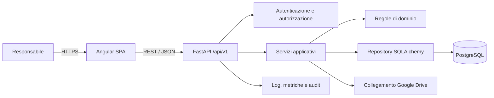
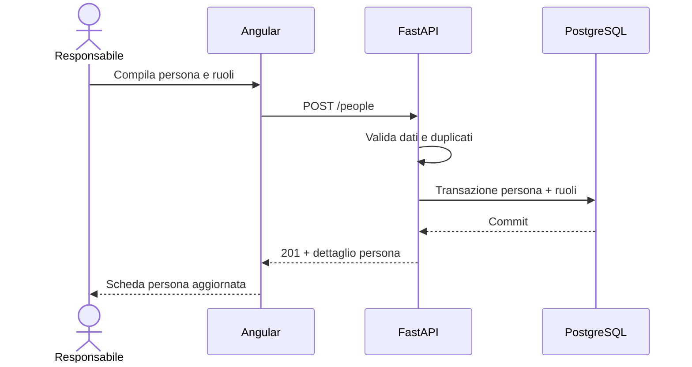

# Arsis — Specifica tecnica della webapp

> **Decisione successiva:** per la distribuzione on-premise su singolo PC, le indicazioni relative a PostgreSQL, Docker e componenti distribuibili sono superate da [ADR 0002 — Distribuzione on-premise e SQLite](docs/adr/0002-on-premise-sqlite.md). I requisiti funzionali e le restanti linee guida architetturali rimangono validi.

**Versione:** 0.2  
**Stato:** proposta tecnica per MVP  
**Data:** 19 agosto 2026  
**Documento funzionale di riferimento:** [SPECIFICA_FUNZIONALE.md](./SPECIFICA_FUNZIONALE.md)

---

## 1. Scopo

Questo documento traduce la specifica funzionale di Arsis in un’architettura implementabile basata su:

- **Backend:** FastAPI;
- **Database:** PostgreSQL;
- **Frontend:** Angular;
- **Protocollo applicativo:** API REST su HTTPS;
- **Formato dati:** JSON;
- **Distribuzione consigliata:** container Docker.

Il documento descrive componenti, responsabilità, modello di persistenza, contratti API, sicurezza, test, distribuzione e criteri tecnici di accettazione.

La Contabilità e l’importazione Excel restano fuori dall’MVP, come stabilito nella specifica funzionale.

## 2. Principi architetturali

### 2.1 Monolite modulare

L’MVP deve essere realizzato come **monolite modulare**, composto da un’applicazione FastAPI e una singola applicazione Angular.

Questa scelta permette di:

- ridurre complessità operativa e costi di distribuzione;
- mantenere transazioni coerenti tra le aree funzionali;
- separare chiaramente i domini nel codice;
- conservare la possibilità di estrarre servizi indipendenti in futuro, se necessario.

Non sono previsti microservizi nell’MVP.

### 2.2 Separazione delle responsabilità

- Angular gestisce presentazione, navigazione, stato dell’interfaccia e validazioni immediate.
- FastAPI applica autorizzazioni, validazioni definitive e regole di business.
- PostgreSQL garantisce persistenza, integrità referenziale e transazioni.
- Le API costituiscono l’unico canale di accesso ai dati applicativi da parte del frontend.

### 2.3 API-first

- Ogni funzione applicativa deve essere esposta tramite un contratto API esplicito.
- La documentazione OpenAPI generata da FastAPI deve rimanere disponibile negli ambienti di sviluppo e collaudo.
- Il frontend non deve dipendere da dettagli interni del database.
- Le API devono essere versionate sotto il prefisso `/api/v1`.

### 2.4 Soft delete

Le entità di dominio non vengono eliminate definitivamente dalle normali API applicative.

Il modello standard comprende:

- `archived_at`;
- `archived_by`;
- eventuale stato di dominio;
- endpoint espliciti di archiviazione e ripristino.

Le cancellazioni fisiche sono ammesse solo in procedure amministrative straordinarie e controllate, non esposte nell’interfaccia ordinaria.

## 3. Versioni e dipendenze

Le versioni definitive devono essere scelte all’avvio dell’implementazione e registrate in una Architecture Decision Record, verificando la compatibilità tra runtime e librerie.

Politica consigliata:

- Python in una versione stabile supportata da FastAPI e dalle dipendenze selezionate;
- FastAPI e Pydantic su versioni stabili compatibili;
- PostgreSQL su una major ancora supportata;
- Angular su una major supportata dal team, preferibilmente LTS o comunque coperta per l’intero ciclo dell’MVP;
- Node.js su una versione compatibile con la major Angular scelta;
- dipendenze bloccate tramite lockfile;
- aggiornamenti automatici proposti da un dependency bot e verificati dalla CI.

Il progetto non deve utilizzare dipendenze prive di manutenzione quando esistono alternative consolidate.

## 4. Architettura logica



### 4.1 Componenti distribuibili

| Componente | Responsabilità |
|---|---|
| `frontend` | Applicazione Angular compilata e servita come contenuto statico |
| `backend` | Applicazione FastAPI e processi applicativi |
| `database` | Istanza PostgreSQL |
| `reverse-proxy` | Terminazione TLS, routing, compressione e header di sicurezza |
| `migration` | Esecuzione controllata di Liquibase standalone |

Per lo sviluppo locale è consigliato Docker Compose. In produzione i componenti possono essere distribuiti sullo stesso host o su servizi gestiti distinti.

## 5. Backend FastAPI

### 5.1 Librerie consigliate

| Ambito | Tecnologia |
|---|---|
| Web framework | FastAPI |
| Modelli API | Pydantic |
| ORM | SQLAlchemy 2.x |
| Driver PostgreSQL | psycopg 3 |
| Migrazioni | Liquibase standalone |
| Autenticazione | libreria JWT mantenuta oppure sessioni firmate |
| Hash password | Argon2id tramite libreria consolidata |
| Server ASGI | Uvicorn, eventualmente gestito da un process manager |
| Test | pytest, pytest-asyncio se si adotta I/O asincrono |
| HTTP test | client di test FastAPI/httpx |

La scelta tra sessioni cookie e access token JWT deve essere incapsulata nel modulo `auth`, senza propagare dettagli crittografici nel dominio.

### 5.2 Organizzazione del codice

Struttura proposta:

```text
backend/
├── pyproject.toml
├── src/
│   └── arsis/
│       ├── main.py
│       ├── core/
│       │   ├── config.py
│       │   ├── database.py
│       │   ├── errors.py
│       │   ├── logging.py
│       │   └── security.py
│       ├── auth/
│       ├── people/
│       ├── activities/
│       ├── school/
│       ├── archive/
│       ├── dashboard/
│       ├── settings/
│       └── audit/
└── tests/
    ├── unit/
    ├── integration/
    └── api/
```

Ogni modulo funzionale contiene, quando necessario:

```text
module/
├── router.py       # endpoint HTTP
├── schemas.py      # request e response Pydantic
├── service.py      # casi d’uso e transazioni
├── repository.py   # query e persistenza
├── models.py       # modelli SQLAlchemy
├── rules.py        # regole di dominio pure
└── errors.py       # errori specifici
```

### 5.3 Regole di dipendenza

- I router dipendono dai servizi, non direttamente dai repository.
- I servizi delimitano le transazioni applicative.
- I repository non contengono decisioni di dominio.
- I modelli Pydantic delle API non vengono riutilizzati come modelli ORM.
- Le regole di dominio devono essere testabili senza avviare FastAPI o PostgreSQL quando non richiedono persistenza.
- I moduli non devono importare router o servizi di altri moduli in modo circolare.

### 5.4 Sincrono o asincrono

Per l’MVP è accettabile sia uno stack SQLAlchemy sincrono sia asincrono. La scelta deve essere uniforme.

Indicazione progettuale:

- preferire sincrono se semplicità operativa e familiarità del team sono prioritarie;
- preferire asincrono solo se il team ne conosce bene implicazioni, session lifecycle e test;
- non mescolare sessioni sincrone e asincrone nei servizi applicativi.

Il carico previsto non giustifica da solo l’adozione dello stack asincrono.

## 6. Database PostgreSQL

### 6.1 Convenzioni generali

- Chiavi primarie UUID generate dall’applicazione o dal database.
- Timestamp memorizzati come `timestamp with time zone` e gestiti internamente in UTC.
- Date di dominio senza orario memorizzate come `date`.
- Importi memorizzati come `numeric`, mai come floating point.
- Nomi di tabelle e colonne in `snake_case`.
- Vincoli di foreign key espliciti.
- Indici definiti sulla base delle query reali.
- Testo libero in `text`; campi limitati in `varchar` solo quando esiste un limite di dominio.
- Stati applicativi in stringhe validate e vincoli `CHECK`, evitando enum PostgreSQL rigidi salvo decisione esplicita.

### 6.2 Colonne comuni

Le tabelle principali includono:

| Colonna | Tipo | Note |
|---|---|---|
| `id` | UUID | chiave primaria |
| `created_at` | timestamptz | obbligatoria |
| `created_by` | UUID nullable | utente autore |
| `updated_at` | timestamptz | obbligatoria |
| `updated_by` | UUID nullable | ultimo autore |
| `archived_at` | timestamptz nullable | soft delete |
| `archived_by` | UUID nullable | autore archiviazione |
| `version` | integer | controllo concorrenza ottimistico |

`version` viene incrementato ad ogni modifica e permette di rilevare salvataggi basati su dati non più aggiornati.

### 6.3 Schema dati proposto

#### Sicurezza

##### `users`

- `id` UUID PK;
- `email` stringa normalizzata, univoca senza distinzione maiuscole/minuscole;
- `password_hash`;
- `display_name`;
- `is_active`;
- `last_login_at`;
- colonne comuni.

##### `refresh_sessions`

Se viene adottata autenticazione con refresh token:

- `id` UUID PK;
- `user_id` FK;
- `token_hash`;
- `expires_at`;
- `revoked_at`;
- informazioni tecniche minime sul client;
- `created_at`.

I refresh token non devono essere conservati in chiaro.

#### Anagrafica

##### `people`

- dati anagrafici comuni;
- contatti;
- indirizzo;
- URL o riferimento alla foto;
- note;
- colonne comuni.

Indici consigliati:

- cognome e nome;
- codice fiscale quando valorizzato;
- email normalizzata quando valorizzata;
- `archived_at`.

Il codice fiscale può avere vincolo univoco parziale se la qualità dei dati lo consente. La decisione va validata prima di rendere il vincolo bloccante.

##### `person_roles`

- `person_id` FK;
- `role_type`: `member`, `musician`, `student`, `teacher`;
- `start_date`;
- `end_date`;
- `status`;
- note;
- colonne comuni.

Vincolo: non devono esistere due assegnazioni attive duplicate dello stesso ruolo alla stessa persona.

##### `associated_contacts`

- `person_id` FK;
- `contact_person_id` FK;
- `relationship_type`;
- `is_primary`;
- `is_payment_contact`;
- note;
- colonne comuni.

Vincoli:

- `person_id <> contact_person_id`;
- unicità della relazione attiva equivalente;
- nessuna cancellazione a cascata delle persone.

##### `members`

- `person_role_id` FK univoca;
- `membership_number`;
- `membership_start_date`;
- `membership_end_date`;
- `annual_fee` numeric nullable;
- note.

La quota annuale è informativa e non produce transazioni contabili.

##### `musicians`

- `person_role_id` FK univoca;
- `joined_on`;
- `left_on`;
- note.

##### `students`

- `person_role_id` FK univoca;
- note.

##### `teachers`

- `person_role_id` FK univoca;
- note;
- campi contabili rinviati.

##### `instruments`

- `name` univoco tra i record attivi;
- `is_active`;
- ordine di visualizzazione.

##### `sections`

- `name` univoco tra i record attivi;
- `is_active`;
- ordine di visualizzazione.

##### `musician_instruments`

- `musician_id` FK;
- `instrument_id` FK;
- `is_primary`;
- vincolo univoco sulla coppia.

Deve esistere al massimo uno strumento principale per musicante.

##### `musician_sections`

- `musician_id` FK;
- `section_id` FK;
- vincolo univoco sulla coppia.

#### Attività

##### `activities`

- `type`: `rehearsal`, `concert`, `event`;
- `title`;
- `description`;
- `starts_at`;
- `ends_at` nullable;
- `location`;
- `status`: `planned`, `confirmed`, `cancelled`, `completed`;
- `reference_person_id` nullable;
- note;
- colonne comuni.

Indici consigliati:

- `starts_at`;
- `type, starts_at`;
- `status, starts_at`;
- `archived_at`.

##### `activity_participants`

- `activity_id` FK;
- `person_id` FK;
- `source`: `automatic`, `manual`;
- `attendance`: nullable, `present` oppure `absent`;
- `attendance_recorded_at` nullable;
- `attendance_recorded_by` nullable;
- colonne comuni.

Vincolo univoco sulla coppia attività-persona.

La tabella materializza i convocati. Le successive modifiche ai ruoli dei musicanti non devono cambiare retroattivamente i partecipanti già salvati.

#### Scuola

##### `courses`

- `name`;
- `description`;
- `mode`: `individual`, `group`;
- `category`: `instrument`, `ensemble`;
- `instrument_id` nullable;
- `teacher_person_id`;
- `weekday` nullable;
- `start_time` nullable;
- `end_time` nullable;
- `annual_fee` numeric;
- `color` appartenente alla palette prevista;
- `valid_from` nullable;
- `valid_to` nullable;
- `status`;
- note;
- colonne comuni.

Regole:

- lo strumento è pertinente ai corsi di categoria `instrument`;
- giorno e orari non generano lezioni;
- l’insegnante deve avere un ruolo insegnante attivo nel periodo pertinente;
- `annual_fee >= 0`;
- il colore deve appartenere alla palette applicativa configurata.

##### `course_installment_templates`

- `course_id` FK;
- `sequence_number`;
- `description` nullable;
- `amount` numeric;
- `due_month` e `due_day`, oppure una data proposta se il piano è legato a un anno;
- colonne comuni.

Il nome esplicita che si tratta di un modello organizzativo, non di una rata contabile dovuta.

Vincoli:

- progressivo univoco per corso;
- importo non negativo;
- somma delle rate mostrata e confrontata con la tariffa annuale.

Una divergenza può essere ammessa solo con avviso esplicito, in attesa della definizione della Contabilità.

##### `enrollments`

- `course_id` FK;
- `student_person_id` FK;
- `enrolled_on`;
- `starts_on`;
- `ends_on` nullable;
- `status`;
- note;
- colonne comuni.

Vincolo applicativo: nessuna iscrizione attiva duplicata per lo stesso allievo, corso e periodo sovrapposto.

##### `enrollment_discounts`

- `enrollment_id` FK univoca;
- `type`: `fixed`, `percentage`;
- `value` numeric;
- `reason`;
- colonne comuni.

Regole:

- valore percentuale compreso tra 0 e 100;
- importo fisso non negativo e non superiore alla tariffa;
- prezzo agevolato calcolato dal backend e restituito al frontend;
- nessun movimento contabile generato.

##### `lessons`

- `course_id` FK;
- `teacher_person_id`;
- `starts_at`;
- `ends_at` nullable;
- `topic` nullable;
- `status`: `planned`, `completed`, `cancelled`;
- note;
- colonne comuni.

Le lezioni vengono inserite manualmente. Non deve esistere un job che le generi dal giorno e orario del corso nell’MVP.

##### `lesson_attendances`

- `lesson_id` FK;
- `student_person_id` FK;
- `attendance`: nullable, `present` oppure `absent`;
- `recorded_at` nullable;
- `recorded_by` nullable;
- colonne comuni.

Vincolo univoco sulla coppia lezione-allievo.

Gli allievi proposti sono quelli con iscrizione attiva alla data della lezione. Le righe materializzate restano storiche.

#### Configurazione e audit

##### `app_settings`

Per l’MVP contiene almeno:

- URL della cartella Google Drive;
- eventuale tema predefinito;
- altri valori globali non sensibili.

I segreti non devono essere salvati in questa tabella.

##### `audit_events`

- `id` UUID;
- `occurred_at`;
- `user_id` nullable;
- `action`;
- `entity_type`;
- `entity_id` nullable;
- `request_id`;
- dettagli tecnici minimizzati in JSON;
- indirizzo IP, solo se previsto dalla policy privacy.

L’audit non deve contenere password, token o copie indiscriminate di dati personali.

### 6.4 Vincoli di cancellazione

Le foreign key devono privilegiare `RESTRICT` o `NO ACTION` per le entità di dominio.

`CASCADE` è ammesso solo per record strettamente dipendenti e privi di significato autonomo, durante procedure fisiche controllate; non sostituisce il soft delete applicativo.

### 6.5 Migrazioni

Liquibase viene usato come strumento **standalone**, separato dal runtime Python.

Vincoli architetturali:

- FastAPI non avvia Liquibase e non esegue migrazioni al bootstrap;
- Liquibase non è installato come dipendenza Python;
- SQLAlchemy non deve creare o modificare lo schema tramite `create_all()` in ambienti condivisi;
- il changelog Liquibase è la fonte autorevole della struttura fisica del database;
- i modelli SQLAlchemy devono essere mantenuti coerenti con lo schema prodotto dal changelog;
- il deployment esegue Liquibase come job separato, prima dell’avvio della nuova versione backend.

#### Formato dei changelog

Struttura consigliata:

```text
database/
├── liquibase.properties.example
├── changelog/
│   ├── db.changelog-master.yaml
│   └── changes/
│       ├── 0001-initial-schema.sql
│       ├── 0002-add-course-colors.sql
│       └── ...
└── tests/
```

Il master changelog può essere YAML; le modifiche PostgreSQL possono essere espresse come **Liquibase formatted SQL**. Questa combinazione mantiene ordinamento e metadati nel master, lasciando visibili indici, vincoli e SQL specifico PostgreSQL.

Ogni changeset deve avere:

- identificativo stabile e univoco;
- autore;
- descrizione chiara;
- precondizioni quando necessarie;
- una sola responsabilità logica;
- strategia di rollback quando sicura e realistica;
- commento esplicito quando il rollback automatico non è possibile.

Regole operative:

- i changeset già applicati non devono essere modificati;
- le correzioni vengono aggiunte con nuovi changeset;
- le migrazioni distruttive richiedono strategia di espansione, backfill e successiva contrazione;
- le modifiche incompatibili devono essere compatibili con almeno una finestra di deployment applicativo;
- `liquibase validate` deve essere eseguito in CI;
- un database di test vuoto deve raggiungere la versione corrente con `liquibase update`;
- le tabelle tecniche `DATABASECHANGELOG` e `DATABASECHANGELOGLOCK` sono gestite da Liquibase;
- l’accesso concorrente alle migrazioni deve essere impedito dal lock Liquibase e dalla pipeline di deployment.

#### Credenziali

- Liquibase usa un’utenza database dedicata con privilegi DDL necessari.
- FastAPI usa un’utenza distinta, limitata alle operazioni DML richieste dall’applicazione.
- Le credenziali Liquibase sono disponibili soltanto alla pipeline o al job di migrazione.
- Nessuna credenziale reale deve essere salvata in `liquibase.properties` nel repository.

#### Coerenza ORM-schema

Poiché non viene usata autogenerazione Python, la coerenza deve essere verificata tramite:

- integration test dei repository contro un PostgreSQL creato da Liquibase;
- test delle query e dei vincoli principali;
- revisione congiunta di changeset e modelli SQLAlchemy nella stessa pull request;
- eventuale controllo automatico di schema diff in CI, purché non modifichi il database.

## 7. Contratto API

### 7.1 Convenzioni

- Base path: `/api/v1`.
- JSON in `snake_case` o `camelCase`, scegliendo una convenzione unica. Si consiglia `camelCase` verso Angular e `snake_case` internamente a Python.
- Date ISO 8601: `YYYY-MM-DD`.
- Timestamp ISO 8601 con offset o suffisso `Z`.
- Paginazione basata su `page` e `page_size` per l’MVP.
- Ordinamento tramite parametri espliciti e campi in allowlist.
- Filtri tramite query parameter documentati.
- Identificatori UUID opachi.
- Risposte di errore secondo un formato uniforme.

### 7.2 Formato lista

```json
{
  "items": [],
  "page": 1,
  "pageSize": 25,
  "totalItems": 0,
  "totalPages": 0
}
```

### 7.3 Formato errore

```json
{
  "error": {
    "code": "ENROLLMENT_OVERLAP",
    "message": "Esiste già un’iscrizione attiva sovrapposta.",
    "fields": {
      "startsOn": "Il periodo si sovrappone a un’iscrizione esistente."
    },
    "requestId": "uuid"
  }
}
```

Il messaggio è presentabile all’utente; `code` permette al frontend di gestire casi noti senza interpretare il testo.

### 7.4 Codici HTTP

| Codice | Uso |
|---|---|
| 200 | lettura o modifica riuscita |
| 201 | creazione riuscita |
| 204 | operazione riuscita senza contenuto |
| 400 | richiesta formalmente non valida |
| 401 | autenticazione assente o scaduta |
| 403 | autenticato ma non autorizzato |
| 404 | risorsa inesistente o non visibile |
| 409 | conflitto di dominio o concorrenza |
| 422 | validazione dei campi |
| 429 | limite di richieste superato |
| 500 | errore interno non previsto |

### 7.5 Endpoint principali

#### Autenticazione

```text
POST   /api/v1/auth/login
POST   /api/v1/auth/refresh
POST   /api/v1/auth/logout
GET    /api/v1/auth/me
```

#### Persone e ruoli

```text
GET    /api/v1/people
POST   /api/v1/people
GET    /api/v1/people/{personId}
PATCH  /api/v1/people/{personId}
POST   /api/v1/people/{personId}/archive
POST   /api/v1/people/{personId}/restore

GET    /api/v1/people/{personId}/roles
POST   /api/v1/people/{personId}/roles
PATCH  /api/v1/people/{personId}/roles/{roleId}
POST   /api/v1/people/{personId}/roles/{roleId}/archive

GET    /api/v1/people/{personId}/associated-contacts
POST   /api/v1/people/{personId}/associated-contacts
PATCH  /api/v1/people/{personId}/associated-contacts/{associationId}
POST   /api/v1/people/{personId}/associated-contacts/{associationId}/archive

GET    /api/v1/people/{personId}/courses
GET    /api/v1/people/{personId}/attendance-history
```

#### Cataloghi musicali

```text
GET    /api/v1/instruments
POST   /api/v1/instruments
PATCH  /api/v1/instruments/{instrumentId}
POST   /api/v1/instruments/{instrumentId}/archive

GET    /api/v1/sections
POST   /api/v1/sections
PATCH  /api/v1/sections/{sectionId}
POST   /api/v1/sections/{sectionId}/archive
```

#### Attività

```text
GET    /api/v1/activities
POST   /api/v1/activities
GET    /api/v1/activities/{activityId}
PATCH  /api/v1/activities/{activityId}
POST   /api/v1/activities/{activityId}/archive
POST   /api/v1/activities/{activityId}/restore

GET    /api/v1/activities/{activityId}/participants
POST   /api/v1/activities/{activityId}/participants/sync-active-musicians
PUT    /api/v1/activities/{activityId}/participants
PUT    /api/v1/activities/{activityId}/attendance
```

La sincronizzazione dei musicanti attivi deve essere un’azione esplicita. La creazione dell’attività effettua una prima materializzazione automatica; successive sincronizzazioni non devono sovrascrivere presenze già registrate senza conferma.

#### Corsi e iscrizioni

```text
GET    /api/v1/courses
POST   /api/v1/courses
GET    /api/v1/courses/{courseId}
PATCH  /api/v1/courses/{courseId}
POST   /api/v1/courses/{courseId}/archive
POST   /api/v1/courses/{courseId}/restore

GET    /api/v1/courses/{courseId}/installment-template
PUT    /api/v1/courses/{courseId}/installment-template

GET    /api/v1/enrollments
POST   /api/v1/enrollments
GET    /api/v1/enrollments/{enrollmentId}
PATCH  /api/v1/enrollments/{enrollmentId}
POST   /api/v1/enrollments/{enrollmentId}/archive
```

#### Lezioni e presenze

```text
GET    /api/v1/lessons
POST   /api/v1/lessons
GET    /api/v1/lessons/{lessonId}
PATCH  /api/v1/lessons/{lessonId}
POST   /api/v1/lessons/{lessonId}/archive

GET    /api/v1/lessons/{lessonId}/attendance
PUT    /api/v1/lessons/{lessonId}/attendance
```

#### Dashboard, archivio e configurazione

```text
GET    /api/v1/dashboard/summary
GET    /api/v1/settings/archive
PUT    /api/v1/settings/archive
GET    /api/v1/settings/course-colors
```

Il frontend può aprire direttamente l’URL Drive restituito. Il backend non deve effettuare proxy dei contenuti Google Drive nell’MVP.

### 7.6 Aggiornamenti e concorrenza

Le risposte di dettaglio includono `version` oppure un `ETag`.

Le modifiche devono inviare la versione letta. Se il record è stato modificato nel frattempo, il backend restituisce `409 CONFLICT` con codice `STALE_VERSION`.

### 7.7 Idempotenza

- Le operazioni massive di salvataggio presenze devono sostituire in modo deterministico lo stato del registro.
- Un retry della stessa richiesta non deve creare partecipazioni duplicate.
- La futura importazione Excel dovrà usare una chiave di importazione idempotente.

## 8. Autenticazione e sicurezza

### 8.1 Flusso consigliato

Per una SPA Angular è consigliato:

- access token a vita breve;
- refresh token ruotato, conservato in cookie `HttpOnly`, `Secure`, `SameSite` adeguato;
- access token conservato in memoria, non in `localStorage`;
- revoca della sessione al logout;
- rate limit sul login e sul refresh.

In alternativa è ammessa una sessione server-side tramite cookie sicuro. La scelta definitiva deve essere documentata con un ADR prima dell’implementazione.

### 8.2 Password

- Hash Argon2id con parametri calibrati sull’ambiente di produzione.
- Nessuna registrazione delle password nei log.
- Politica minima di lunghezza; evitare regole arbitrarie di composizione.
- Possibilità amministrativa di disabilitare un utente.
- Recupero password rinviabile se gli utenti vengono inizialmente gestiti da un amministratore tecnico.

### 8.3 Protezioni HTTP

- HTTPS obbligatorio in produzione.
- CORS limitato agli origin configurati.
- Header di sicurezza configurati dal reverse proxy.
- Content Security Policy compatibile con Angular e con i font adottati.
- Protezione CSRF se l’autenticazione usa cookie inviati automaticamente.
- Limiti sulla dimensione delle richieste e degli upload.
- Validazione MIME e contenuto per l’eventuale foto persona.

### 8.4 Autorizzazione

Nell’MVP esiste un solo ruolo applicativo `responsible`. L’autorizzazione deve comunque essere centralizzata, in modo da permettere ruoli futuri senza riscrivere i router.

Ogni endpoint applicativo, esclusi login e health check, richiede un utente attivo.

### 8.5 Dati personali

- Raccogliere solo dati previsti dalla specifica funzionale.
- Non inserire dati personali nei log applicativi salvo necessità esplicita.
- Proteggere backup e ambienti di collaudo.
- Usare dati sintetici in sviluppo quando possibile.
- Definire tempi e modalità di conservazione prima della produzione.

## 9. Frontend Angular

### 9.1 Scelte fondamentali

- Componenti standalone.
- Angular Router con lazy loading per area.
- Reactive Forms per tutti i moduli di inserimento e modifica.
- HttpClient per le API.
- Signals per lo stato locale e derivato.
- RxJS per flussi asincroni, cancellazione e composizione delle richieste.
- Change detection moderna e componenti progettati per aggiornamenti prevedibili.
- TypeScript in modalità strict.

Non è necessario introdurre uno store globale esterno nell’MVP. Se la complessità dello stato cresce, la decisione deve essere motivata con un ADR.

### 9.2 Struttura del progetto

```text
frontend/
├── angular.json
├── package.json
├── src/
│   ├── main.ts
│   ├── styles/
│   │   ├── tokens.css
│   │   ├── reset.css
│   │   └── global.css
│   ├── app/
│   │   ├── app.config.ts
│   │   ├── app.routes.ts
│   │   ├── core/
│   │   │   ├── auth/
│   │   │   ├── http/
│   │   │   ├── layout/
│   │   │   └── config/
│   │   ├── shared/
│   │   │   ├── ui/
│   │   │   ├── forms/
│   │   │   ├── pipes/
│   │   │   └── models/
│   │   └── features/
│   │       ├── home/
│   │       ├── people/
│   │       ├── activities/
│   │       ├── school/
│   │       ├── archive/
│   │       ├── accounting/
│   │       └── settings/
│   └── assets/
└── tests/
```

### 9.3 Routing

```text
/login
/home
/people
/people/:personId
/activities
/activities/calendar
/activities/:activityId
/activities/:activityId/attendance
/school/courses
/school/courses/:courseId
/school/enrollments
/school/lessons
/school/lessons/:lessonId
/school/lessons/:lessonId/attendance
/archive
/accounting
/settings
```

Le route protette utilizzano una guard di autenticazione. La pagina Contabilità presenta esclusivamente il segnaposto previsto.

### 9.4 Layout

- Topbar con Home, Soci, Attività, Scuola, Archivio e Contabilità.
- Sidebar contestuale all’area attiva.
- Area contenuto ottimizzata per desktop.
- Menu utente con logout e accesso alla configurazione.
- Breadcrumb solo nelle viste di dettaglio profonde, se utile.

### 9.5 Design system

Il file `src/styles/tokens.css` deve derivare da **Arsis — Design Tokens v1.1**.

Regole:

- nessun colore di brand hardcoded nei componenti;
- usare `var(--color-accent)` e gli altri token semantici;
- tema chiaro predefinito;
- predisposizione agli override `[data-theme="dark"]`;
- DM Sans per l’interfaccia;
- Fraunces per titoli e metriche previste;
- DM Mono per date, codici fiscali, percentuali e futuri importi;
- spaziatura su griglia 4 px;
- colori corso gestiti come dati applicativi, non token di tema;
- avatar con classi cromatiche predefinite e assegnazione stabile.

L’eventuale libreria di componenti deve essere adattata ai token Arsis. Non deve introdurre una seconda palette o una tipografia concorrente.

### 9.6 Componenti condivisi

Componenti minimi:

- shell applicativa;
- topbar e sidebar;
- page header;
- tab;
- tabella con paginazione, filtri e empty state;
- campo ricerca;
- badge di stato;
- avatar;
- date picker e time input;
- dialog di conferma;
- toast/notifica;
- loader e skeleton;
- error state;
- form field con errori;
- selettore persona;
- selettore strumenti/sezioni;
- registro presenze rapido;
- course color picker.

### 9.7 Modelli e client API

- I tipi TypeScript delle API devono essere generati dall’OpenAPI o mantenuti in un layer API dedicato.
- I modelli ricevuti non devono essere modificati direttamente nei componenti.
- Il mapping tra DTO e form model deve essere esplicito nei casi complessi.
- Un interceptor deve aggiungere autenticazione, request ID quando previsto e gestione uniforme degli errori.
- Le richieste non più necessarie devono essere cancellate durante ricerca e navigazione.

### 9.8 Gestione dello stato

- Stato remoto mantenuto nei service delle feature.
- Stato effimero del form mantenuto nel componente o in un form service dedicato.
- Filtri importanti riflessi nei query parameter per mantenere navigazione e refresh.
- Cache limitata a cataloghi e dati stabili; invalidazione esplicita dopo le modifiche.
- Nessuna duplicazione persistente di dati di dominio nel browser.

### 9.9 Form e validazione

- Le regole semplici vengono replicate nel frontend per feedback immediato.
- Il backend rimane la fonte autorevole.
- Gli errori `422` vengono associati ai campi corrispondenti.
- Gli errori di dominio `409` vengono mostrati in modo contestuale.
- In caso di `STALE_VERSION`, l’utente deve poter ricaricare i dati senza perdere inconsapevolmente il lavoro.

### 9.10 Accessibilità

- Navigazione completa da tastiera.
- Focus visibile tramite i token Arsis.
- Label esplicite per input e controlli.
- Contrasto conforme almeno a WCAG AA per i contenuti ordinari.
- Tabelle con intestazioni semantiche.
- Dialog con focus trap e restituzione del focus.
- Stati non comunicati tramite il solo colore.
- Riduzione delle animazioni quando l’utente preferisce `prefers-reduced-motion`.

## 10. Flussi tecnici principali

### 10.1 Creazione persona con ruoli



La creazione di persona e ruoli iniziali può avvenire nella stessa transazione tramite un payload composito, pur mantenendo endpoint separati per modifiche successive.

### 10.2 Creazione attività

1. Angular invia i dati dell’attività.
2. FastAPI crea l’attività.
3. Nella stessa transazione seleziona i musicanti attivi alla data dell’attività.
4. Crea le righe `activity_participants` con origine automatica.
5. Restituisce attività e numero di convocati.
6. Il responsabile può modificare manualmente l’elenco.

### 10.3 Creazione lezione

1. Il responsabile seleziona corso, data e orario.
2. Il backend valida corso e insegnante.
3. Il backend crea la lezione.
4. Nella stessa transazione materializza gli allievi con iscrizione attiva alla data.
5. Le presenze rimangono inizialmente `null`.

### 10.4 Salvataggio presenze

Il frontend invia l’elenco completo modificato. Il backend:

- verifica che le persone appartengano al registro;
- aggiorna solo i valori ammessi;
- registra autore e data;
- restituisce il registro aggiornato e i conteggi;
- completa l’operazione in una singola transazione.

## 11. Foto e file

L’MVP richiede una decisione esecutiva sullo storage delle foto persona.

Soluzione consigliata:

- object storage compatibile S3 in produzione;
- storage locale astratto in sviluppo;
- database contenente solo chiave, metadata e riferimento;
- URL firmati o endpoint autorizzato per l’accesso;
- limite di dimensione e formati ammessi;
- generazione di thumbnail;
- rimozione dei metadata EXIF non necessari.

Le foto non devono essere salvate direttamente come BLOB nella tabella `people` salvo motivazione documentata.

La cartella Google Drive resta un semplice collegamento esterno e non viene usata automaticamente per le foto.

## 12. Configurazione applicativa

### 12.1 Variabili d’ambiente backend

Esempi:

```text
APP_ENV
APP_SECRET_KEY
DATABASE_URL
ALLOWED_ORIGINS
ACCESS_TOKEN_TTL
REFRESH_TOKEN_TTL
LOG_LEVEL
PHOTO_STORAGE_BACKEND
PHOTO_STORAGE_BUCKET
```

I nomi definitivi devono essere documentati in `.env.example`, privo di segreti reali.

### 12.2 Configurazione frontend

Il frontend deve ricevere almeno:

- base URL API;
- identificativo ambiente;
- eventuale configurazione del monitoraggio errori;
- feature flag non sensibili.

I segreti non possono essere protetti in un bundle frontend e non devono esservi inseriti.

### 12.3 Segreti

- Segreti in secret manager o meccanismo equivalente del provider.
- Nessun segreto nel repository.
- Rotazione possibile senza ricompilare il frontend.
- Credenziali database distinte per applicazione, migrazioni e backup quando l’infrastruttura lo permette.

## 13. Logging, audit e monitoraggio

### 13.1 Logging

- Log strutturati JSON in produzione.
- Request ID propagato dal reverse proxy o generato dal backend.
- Livelli coerenti: debug, info, warning, error.
- Stack trace solo nei log server, mai nelle risposte API.
- Redazione di token, password e dati sensibili.

### 13.2 Health check

```text
GET /health/live
GET /health/ready
```

- `live`: processo avviato.
- `ready`: database raggiungibile e applicazione pronta a servire richieste.

### 13.3 Metriche minime

- numero richieste;
- durata richieste;
- errori per endpoint e codice;
- connessioni database;
- fallimenti login;
- durata query lente;
- esito dei backup.

### 13.4 Audit funzionale

Devono essere tracciate almeno:

- creazione, modifica, archiviazione e ripristino delle persone;
- variazione dei ruoli;
- variazione dei partecipanti;
- registrazione o modifica massiva delle presenze;
- creazione e modifica di corsi, iscrizioni e lezioni;
- modifica dell’URL dell’archivio;
- gestione degli utenti responsabili.

## 14. Test

### 14.1 Backend

- Unit test per regole di dominio e calcoli.
- Integration test con PostgreSQL reale o containerizzato.
- API test per autenticazione, validazione, errori e autorizzazione.
- Test Liquibase `validate` e `update` su database vuoto e su snapshot rappresentativo.
- Test di concorrenza per il campo `version`.
- Test di isolamento tra casi d’uso transazionali.

### 14.2 Frontend

- Unit test per componenti e servizi con logica significativa.
- Test dei form e delle validazioni.
- Test dei router guard e interceptor.
- Component test per tabelle, dialog e registro presenze.
- End-to-end test dei flussi critici.

### 14.3 Flussi end-to-end minimi

1. Login e logout.
2. Creazione persona con più ruoli.
3. Collegamento contatto associato.
4. Assegnazione strumenti e sezioni.
5. Creazione attività con convocati automatici.
6. Registrazione presenze attività.
7. Creazione corso, piano rate e iscrizione agevolata.
8. Creazione lezione e registrazione presenze.
9. Archiviazione e ripristino senza perdita dello storico.
10. Apertura del link Google Drive.

### 14.4 Qualità del codice

La CI deve eseguire almeno:

Backend:

- formatter;
- linter;
- type checker;
- test;
- validazione dei changelog Liquibase;
- analisi delle dipendenze vulnerabili.

Frontend:

- formatter;
- lint;
- compilazione TypeScript strict;
- unit test;
- build di produzione;
- analisi delle dipendenze vulnerabili.

## 15. Prestazioni

Obiettivi iniziali, da misurare in ambiente rappresentativo:

- risposte API ordinarie entro 500 ms al percentile 95, esclusi upload e processi esterni;
- caricamento delle liste tramite paginazione server-side;
- ricerca con debounce sul frontend;
- indici sulle query di calendario, anagrafica e registri;
- niente query N+1 nelle liste;
- payload di dettaglio limitati ai dati necessari;
- caricamento lazy delle feature Angular.

I limiti non sostituiscono il profiling. Le ottimizzazioni devono essere guidate da misure.

## 16. Backup e ripristino

- Backup automatici del database.
- Conservazione definita in base all’ambiente e agli obblighi organizzativi.
- Cifratura dei backup.
- Test periodico del ripristino.
- Procedure documentate per perdita database e rollback applicativo.
- Backup dello storage foto coordinato con il database.

Prima della produzione devono essere definiti RPO e RTO accettabili dall’associazione.

## 17. Distribuzione

### 17.1 Ambienti

- `local`: sviluppo individuale;
- `test`: esecuzione automatica;
- `staging`: collaudo integrato;
- `production`: dati reali.

Staging e produzione devono avere configurazioni separate e non condividere database o segreti.

### 17.2 Container

- Immagini con base minimale e versione fissata.
- Build multi-stage per Angular e backend.
- Esecuzione come utente non root.
- Health check configurati.
- Nessun file `.env` incorporato nell’immagine.
- Tag immutabile collegato al commit.

### 17.3 Pipeline proposta

1. Installazione dipendenze da lockfile.
2. Lint, type check e test.
3. Build frontend e backend.
4. Scansione dipendenze e immagini.
5. Pubblicazione immagini.
6. Validazione ed esecuzione di Liquibase standalone come job controllato.
7. Deployment applicativo.
8. Smoke test.
9. Possibile rollback se gli smoke test falliscono.

## 18. Struttura del repository

```text
arsis/
├── README.md
├── SPECIFICA_FUNZIONALE.md
├── SPECIFICA_TECNICA.md
├── database/
│   ├── liquibase.properties.example
│   └── changelog/
├── docs/
│   ├── adr/
│   ├── api/
│   └── operations/
├── backend/
├── frontend/
├── infra/
│   ├── docker/
│   └── compose/
├── scripts/
├── .env.example
└── compose.yaml
```

Frontend e backend possono vivere nello stesso repository per semplificare modifiche coordinate e CI dell’MVP.

## 19. Decisioni tecniche da formalizzare con ADR

Prima o durante l’avvio dello sviluppo devono essere registrate almeno queste decisioni:

1. versioni esatte di Python, FastAPI, PostgreSQL, Angular, Node.js e Liquibase;
2. SQLAlchemy sincrono o asincrono;
3. sessione cookie o access token/refresh token;
4. libreria o strategia per i componenti UI;
5. storage delle foto;
6. provider di hosting e database;
7. strategia email per recupero password, se inclusa;
8. formato JSON `camelCase` o `snake_case`;
9. strategia di generazione del client Angular da OpenAPI;
10. RPO, RTO e conservazione dei backup.

## 20. Criteri tecnici di accettazione dell’MVP

L’MVP è tecnicamente accettabile quando:

1. frontend Angular e backend FastAPI sono compilabili e distribuibili automaticamente;
2. PostgreSQL può essere creato da zero eseguendo `liquibase validate` e `liquibase update` con il tool standalone;
3. le API sono disponibili sotto `/api/v1` e documentate tramite OpenAPI;
4. autenticazione, logout e disabilitazione utente funzionano;
5. tutti gli endpoint di dominio richiedono autenticazione;
6. il soft delete è applicato alle entità previste;
7. le principali regole di dominio sono protette sia dal servizio sia, quando possibile, da vincoli database;
8. le modifiche concorrenti non sovrascrivono silenziosamente dati più recenti;
9. i dieci flussi end-to-end minimi superano i test;
10. la UI usa i design token Arsis senza palette parallele;
11. non risultano segreti nel repository o nel bundle frontend;
12. log e risposte non espongono password, token o stack trace;
13. backup e procedura di ripristino sono documentati e provati prima della produzione;
14. health check e monitoraggio minimo sono attivi;
15. la Contabilità rimane isolata come placeholder e non introduce modelli prematuri.

## 21. Fuori perimetro tecnico dell’MVP

- Microservizi.
- Message broker e code distribuite.
- Event sourcing.
- GraphQL.
- WebSocket o aggiornamenti real-time.
- Applicazione mobile nativa.
- Funzionamento offline.
- Integrazione API con Google Drive.
- Importazione Excel.
- Motore contabile.
- Portali separati per insegnanti, allievi e famiglie.
- Multi-tenancy per più associazioni.

Queste esclusioni non impediscono evoluzioni future, ma evitano complessità non giustificata nell’MVP.
